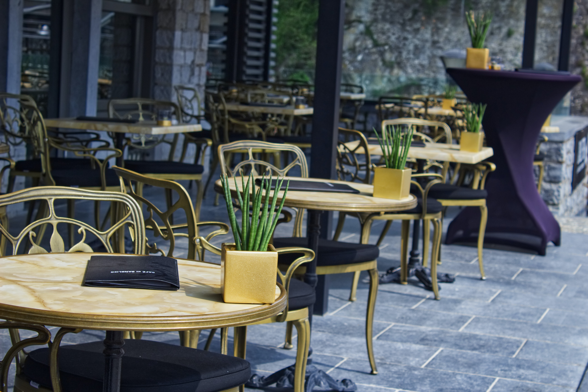

// URLs
:openshift-console-url: {openshift-host}/dashboards
:fuse-documentation-url: https://access.redhat.com/documentation/en-us/red_hat_fuse/{fuse-version}/
:amq-documentation-url: https://access.redhat.com/documentation/en-us/red_hat_amq/{amq-version}/

//attributes
:title: 2 - Use an Apache Camel K Integration to stream events
:standard-fail-text: Verify that you followed all the steps. If you continue to have issues, contact your administrator.
:bl: pass:[ +]

[id='2-use-camel-k-integration-for-event-streaming']
= {title}

We live in an era when business events flow around us like water. You can use Apache Camel K integrations to interact with these events in myriad ways.

In this Solution Pattern, you will be helping out the Main Street Diner with a project.

== The Main Street Diner

The Main Street Diner is a small, successful restaurant off main street with inside seating for twenty and a sought-after outdoor patio that can seat eight. The restaurant manager is seeking to add some automated alerts so they know when to offer their outdoor seating, which changes things in subtle but significant ways for servicing, setup, and teardown on a daily basis.

The restaurant manager has asked you to set up a basic alert system that shows up on the POS screen when the day’s host or hostess comes online and signs in.

// Photo by <a href="https://unsplash.com/@mdc_photography2000?utm_source=unsplash&amp;utm_medium=referral&amp;utm_content=creditCopyText">Milan De Clercq</a> on <a href="/s/photos/outside-dining?utm_source=unsplash&amp;utm_medium=referral&amp;utm_content=creditCopyText">Unsplash</a>

== The Solution
In this solution pattern, we will use the MetaWeather API service which is an Open API that provides weather information based on a particular `Where on Earth ID` (`WOEID`). We can use this service to retrieve JSON-formatted data which will be used in the solution pattern. 

We will use the restaurant's Red Hat Integration (RHI) system which is already in place, create an event using Red Hat AMQ, and create a new Camel K route that performs the call to the MetaWeather API, processes the necessary JSON data, and adds a streamlined event to be used downstream. 

The diner's POS system contains a widget which displays the day’s forecast which will help the diner staff to plan for the day. 

[type=walkthroughResource,serviceName=openshift]
.Red Hat OpenShift
****
* link:{openshift-console-url}[Console, window="_blank"]
* link:https://docs.openshift.com/dedicated/4/welcome/index.html/[OpenShift Documentation, window="_blank"]
* link:https://blog.openshift.com/[OpenShift Blog, window="_blank"]
****

[type=walkthroughResource]
.Microsoft Visual Studio Code
****
* link:https://code.visualstudio.com/[VS Code, window="_blank"]
* link:https://code.visualstudio.com/docs[VS Code Documentation, window="_blank"]
****

:sectnums:

[time=5]
[id='creating-a-project']
== Creating Projects
:task-context: creating-projects

This demonstration spans three namespaces in the cluster, one hosting the Streaming services, one hosting the broker, and a main namespace for all the system applications.

We will create separate projects to partition integration, event streaming and event brokering resources. Each project will follow the same basic isolation pattern to ensure that the resources are installed where they are used and do not clutter up the cluster.

The three projects we will create are:

* camel-k-event-streaming
* event-streaming-kafka-cluster
* event-streaming-messaging-broker

****
*Creating new projects in OpenShift*
****
Follow these steps to create a new eventing project:

. In the link:{openshift-console-url}[OpenShift Console, window="_blank"], log in using an account with cluster administrator privileges.
. Create a new OpenShift project:

.. In the left navigation menu, click *Home > Project > Create Project*.
.. Enter a project named `camel-k-event-streaming` and click *Create*.
. Monitor the OpenShift Console until a green check mark is displayed next to the new project.

Repeat this process for `event-streaming-kafka-cluster` and `event-streaming-messaging-broker`.

[type=verification]
Look at the link:openshift-console-url: {openshift-host}/projects[OpenShift, window="_blank"] console. Do you see your newly created projects displayed in the *Projects* list?

[type=verificationFail]
{standard-fail-text}

// end::task-creating-projects[]

[time=30]
[id='installing-operators']
== Installing Operators
:task-context: installing-operators

With the projects created, we can now install each of the following operators which we will need for each namespace:

* camel-k-event-streaming (Red Hat Integration - Camel K Operator)
* event-streaming-kafka-cluster (Red Hat Integration - AMQ Streams Operator)
* event-streaming-messaging-broker (Red Hat Integration - AMQ Broker Operator)

****
*Installing Operators*
****

Follow these steps to install the Camel K operator (cluster admin rights are necessary).

. Go to the link:{openshift-console-url}[OpenShift Console, window="_blank"].

. In the left navigation menu, click *Catalog* > *OperatorHub*.
. Select `camel-k-event-streaming` as the project in the Project dropdown.
. In the *Filter by keyword* text box, enter `Camel K` to find the *Red Hat Integration - Camel K Operator*.

. Read the information about the Operator, and click *Install*. This displays the *Create Operator Subscription* page.

. Select the following subscription setting:
** *Installation Mode* > *A specific namespace on the cluster* > *my-camel-k-project*

. Click *Subscribe*. This displays the *Operators* > *Installed Operators* page.

. Wait a few moments until the *Status* for the Camel K Operator displays *Succeeded* and the subscription is *Up to Date*. A green check mark will also be displayed next to the new operator.

Repeat the process to install the *Red Hat Integration - AMQ Streams Operator* on the `event-streaming-kafka-cluster` namespace and *Red Hat Integration - AMQ Broker Operator* on the `event-streaming-messaging-broker` namespace.

[type=verification]
Look at the link:openshift-console-url: {openshift-host}/k8s/all-namespaces/operators.coreos.com~v1alpha1~ClusterServiceVersion[OpenShift, window="_blank"] console. Do you see your newly installed operators displayed in the *Installed Operators* list on the namespaces you selected?

[type=verificationFail]
{standard-fail-text}

// end::task-installing-operators[]

[time=5]
[id='creating-kafka-topics']
== Create a Kafka Topic
:task-context: creating-kafka-topic

With the projects created and operators installed, we start setting up our event flow. In the Streaming namespace, we will have a topic listening to events (weather).

****
*Creating a Kafka Topic*
****

Follow these steps to create a new Kafka topic.

. Go to the link:{openshift-console-url}[OpenShift Console, window="_blank"].

. In the left navigation menu, click *Operators* > *Installed Operators*.
.. Select `event-streaming-kafka-cluster` as the project in the Project dropdown.
.. Click on *Red Hat Integration - AMQ Streams*. This will take you to the Operator hub where you can create Kafka artifacts.
.. Find *Kafka Topic* and click *Create Instance*.
.. Change `my` to `weather` in the YAML to change `my-topic` to `weather-topic` and `my-cluster` to `weather-cluster`. 
.. Click *Create*.
. Monitor the *KafkaTopics* page until the new topic appears.

[type=verification]
(Not sure how to verify that this was created successfully since it doesn't change from Status: Unknown, but it does show up in the list)
. Go to the link:{openshift-console-url}[OpenShift Console, window="_blank"].
. Go to *Operators* -> *Installed Operators*.
.. Select `event-streaming-kafka-cluster` as the project in the Project dropdown at the top.
.. Click on `Red Hat Integration - AMQ Streams`. It will take you to the Operator hub where you can create Kafka artifacts.
.. Click on the `Kafka Topic` link in the list of Kafka tabs.
.. Verify that `weather-topic` appears in the list of Kafka Topics.

[type=verificationFail]
{standard-fail-text}

// end::task-creating-kafka-topic[]

[time=5]
[id='creating-broker-addresses']
== Create the Broker Addresses and Queues
:task-context: creating-broker-addresses

****
*Creating Broker Addresses and Queues*
****

[type=verification]
(Verify that the addresses and queues were created properly)

[type=verificationFail]
{standard-fail-text}

// end::task-creating-broker-addresses[]

[time=30]
[id='creating-integration']
== Create the Integration
:task-context: creating-integration

****
*Creating a Camel K Integration*
****

[type=verification]
(Verify that the integration was created and is running)

[type=verificationFail]
{standard-fail-text}

// end::task-creating-integration[]
