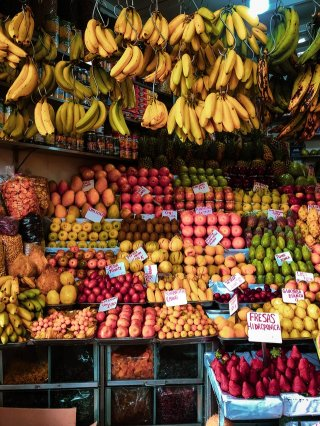

// URLs
:openshift-console-url: {openshift-host}/dashboards
:openshift-catalog-url: {openshift-host}/catalog
:openshift-topology-url: {openshift-host}/topology
:openshift-projects-url: {openshift-host}/k8s/cluster/projects
:openshift-installed-operators-url: {openshift-host}/k8s/ns/fruit-stand/operators.coreos.com~v1alpha1~ClusterServiceVersion
:openshift-add-url: {openshift-host}/add:fuse-documentation-url: https://access.redhat.com/documentation/en-us/red_hat_fuse/{fuse-version}/
:amq-documentation-url: https://access.redhat.com/documentation/en-us/red_hat_amq/{amq-version}/

//attributes
:title: 3 - A Simple Fruit Stand
:standard-fail-text: Verify that you followed all the steps and if you experience any issues, please contact your administrator.
:bl: pass:[ +]
:imagesdir: images

[id='3-camel-k-kafka-fruit-stand']
= {title}

We live in an era when business events are everywhere. Apache Camel K integrations and event-driven services to help tie some of those events together. 

In this Solution Pattern, you will be helping with a virtual fruit stand and creating a simple Camel K integration that pulls fruit from an online source of fruit-related nutritional information.

// Resources included in the right-side of the Pattern -- format specified by SolX

[type=walkthroughResource,serviceName=openshift]
.Red Hat OpenShift
****
* link:{openshift-console-url}[Console, window="_blank"]
* link:https://docs.openshift.com/dedicated/4/welcome/index.html/[OpenShift Documentation, window="_blank"]
* link:https://blog.openshift.com/[OpenShift Blog, window="_blank"]
****

[type=walkthroughResource]
.Red Hat AMQ Streams
****
* link:https://access.redhat.com/documentation/en-us/red_hat_amq/7.7/html/amq_streams_on_openshift_overview/[AMQ Streams on OpenShift Documentation, window="_blank"]
****

[type=walkthroughResource]
.Apache Camel K
****
* link:https://camel.apache.org/camel-k/latest/index.html[Apache Camel K Documentation, window="_blank"]
****

[type=walkthroughResource]
.Fruityvice webservice
****
* link:https://fruityvice.com/[Fruityvice webservice, window="_blank"]
****

== The Fruit Vendor

// Photo by Kristina Gain from Pexels

The Fruit Vendor offers a stall in the market and a veritable wonderland of options for shoppers in need of produce. 

The manager of the site has asked you to start to pull together information on their produce to help inform the buyer of nutritional details. Details such as:

* Calories
* Carbohydrates
* Fats
* Protein
* Sugar

=== The Solution

In this solution pattern, we will use the Fruityvice API service which is an Open API that provides nutritional data for all kinds of fruit. We can use this service to retrieve JSON-formatted data which will be used in the solution pattern. 

Fruityvice enables you to use a GET call and retrieve JSON around common fruits. For example, a GET about data for `Banana` returns:

....
{
    "genus": "Musa",
    "name": "Banana",
    "id": 1,
    "family": "Musaceae",
    "order": "Zingiberales",
    "nutritions": {
        "carbohydrates": 22,
        "protein": 1,
        "fat": 0.2,
        "calories": 96,
        "sugar": 17.2
    }
}
....

{bl}
We will use The Fruit Vendor's Red Hat Integration (RHI) system which is already in place, create an event using Red Hat AMQ, and create a new Camel K route which performs the call to the Fruityvice API, processes the returned JSON data, and adds a streamlined event to be used downstream. 

:sectnums:

[time=5]
[id='creating-a-project']
== Creating a Project
:task-context: creating-a-project

This demonstration requires a single project with event streaming and Camel K resources. In this step we will create a project `fruit-stand` project.

****
*Creating new projects in OpenShift*
****
Follow these steps to create a new eventing project:

. In the link:{openshift-console-url}[OpenShift Console, window="_blank"], log in using an account with cluster administrator privileges.
. Create a new OpenShift project:
.. Navigate to *Home* -> *Projects*.
.. Click *Create Project*.
.. In the *Create Project* dialog box, enter `fruit-salad`, in the *Name* field.
.. Optional: Add the *Display Name* and *Description* details for the project.
.. Click *Create*.

. Monitor the OpenShift Console until a green check mark is displayed next to the new project.

[type=verification]
Go to link:{openshift-projects-url}[OpenShift Console->Projects, window="_blank"] in the console. Do you see your newly created project displayed in the *Projects* list?

[type=verificationFail]
{standard-fail-text}

// end::task-creating-a-project[]

[time=10]
[id='installing-operators']
== Installing Operators
:task-context: installing-operators

With the project created, we can now install each of the following operators which we will need for each namespace:

* Red Hat Integration - Camel K Operator
* Red Hat Integration - AMQ Streams Operator

// These links should work, but it opens into an error state - do we have a better link to point to for these operators?
//* link:{https://catalog.redhat.com/software/operators/detail/5ef256e84a5747832973cc6b}[Red Hat Integration - Camel K Operator, window="_blank"]
//* link:{https://catalog.redhat.com/software/operators/detail/5ef20efd46bc301a95a1e9a4}[Red Hat Integration - AMQ Streams Operator, window="_blank"]

{bl}
Follow these steps to install the Camel K operator (cluster admin rights are necessary).

. Go to *Operators > OperatorHub* in the link:{openshift-host}/operatorHub[OpenShift Console, window="_blank"].
. Make sure `fruit-stand` is selected as the project in the Project dropdown.
. In the *Filter by keyword* text box, enter `Camel K` to find the *Red Hat Integration - Camel K Operator*.
. Read the information about the Operator, and click *Install*. 
. On the *Create Operator Subscription* page, select the following subscription setting:
** *Installation Mode > A specific namespace on the cluster > fruit-stand*
. Click *Subscribe* to make the Operator available to the selected namespace, the upgrade status should resolve to *Up to date* without intervention.
. After the upgrade status of the Subscription is *Up to date*, select *Operators → Installed Operators*. The Camel K Operator *Status* should ultimately resolve to *InstallSucceeded* in the relevant namespace.

{bl}
Repeat the process to install the *Red Hat Integration - AMQ Streams Operator* into the `fruit-stand` namespace.

[type=verification]
Go to the link:{openshift-installed-operators-url}[OpenShift Console->Operators->Installed Operators, window="_blank"]. Do you see your newly installed operators displayed in the *Installed Operators* list on the namespaces you selected?

[type=verificationFail]
{standard-fail-text}

// end::task-installing-operators[]

[time=5]
[id='creating-kafka-instance']
== Create a Kafka Instance
:task-context: creating-kafka-instance

With the projects created and operators installed, we start setting up our event flow. We need to create a Kafka instance to get us started.

****
*Creating a Kafka Instance*
****

Follow these steps to create a new Kafka instance.

. Go to the link:{openshift-installed-operators-url}[OpenShift Console->Operators->Installed Operators, window="_blank"].
.. Make sure `fruit-stand` is selected as the project in the Project dropdown.
.. Click on *Red Hat Integration - AMQ Streams*. This will take you to the Operator page where you can create Kafka artifacts.
.. In the *Provided APIs* on the *Details* page, locate *Kafka* and click *Create Instance*, or click on *Kafka* in the list of tabs and then click *Create Kafka*.
.. Click *Edit Form* to view the options, but leave all settings to their defaults.
.. Click *Create*.
. Monitor the *Kafkas* page until the new Kafka instance appears.

[type=verification]
. Go to the link:{openshift-installed-operators-url}[OpenShift Console->Operators->Installed Operators, window="_blank"].
.. Make sure `fruit-stand` is selected as the project in the Project dropdown.
.. Click on `Red Hat Integration - AMQ Streams`. It will take you to the Operator hub where you can create Kafka artifacts.
.. Click on the `Kafka` link in the list of Kafka tabs.
.. Verify that `my-cluster` appears in the list of Kafka instances.

[type=verificationFail]
{standard-fail-text}

// end::task-creating-kafka-instance[]

[time=5]
[id='creating-kafka-topic']
== Create a Kafka Topic
:task-context: creating-kafka-topic

With the projects created and operators installed, we start setting up our event flow. In the Streaming namespace, we will have a topic listening for events (fruits).

****
*Creating a Kafka Topic*
****

Follow these steps to create a new Kafka topic.

. Go to the link:{openshift-installed-operators-url}[OpenShift Console->Operators->Installed Operators, window="_blank"].
.. Make sure `fruit-stand` is selected as the project in the Project dropdown.
.. Click on *Red Hat Integration - AMQ Streams*. This will take you to the Operator page where you can create Kafka artifacts.
.. Find *Kafka Topic* and click *Create Instance*.
.. Click *Edit Form* to peruse the options in a user-friendly format.
.. Change the Name from `my-topic` to `fruits`. 
.. Click *Create*.
. Monitor the *KafkaTopics* page until the new topic appears.

[type=verification]
. Go to the link:{openshift-installed-operators-url}[OpenShift Console->Operators->Installed Operators, window="_blank"].
.. Make sure `fruit-stand` is selected as the project in the Project dropdown.
.. Click on `Red Hat Integration - AMQ Streams`.
.. Click on the `Kafka Topic` link in the list of Kafka tabs.
.. Verify that `fruits` appears in the list of Kafka Topics.

[type=verificationFail]
{standard-fail-text}

// end::task-creating-kafka-topic[]

[time=5]
[id='creating-integration1']
== Create the First Integration
:task-context: creating-integration1

****
*Creating the first Camel K Integration*
****

Follow these steps to create a new Camel K integration.

. Go to the link:{openshift-installed-operators-url}[OpenShift Console->Operators->Installed Operators, window="_blank"].
.. Make sure `fruit-stand` is selected as the project in the Project dropdown.
.. Click on *Red Hat Integration - Camel K*. This will take you to the Operator page where you can create Camel K artifacts.
.. Find *Integration* and click *Create Instance*.
.. Replace the YAML with this text (expand, select, copy and paste):
+
----
apiVersion: camel.apache.org/v1
kind: Integration
metadata:
  generation: 1
  name: fruits-producer
  selfLink: /apis/camel.apache.org/v1/namespaces/fruit-stand/integrations/fruits-producer
spec:
  dependencies:
  - camel:http
  sources:
  - content: "import org.apache.camel.BindToRegistry;\nimport javax.net.ssl.HostnameVerifier;\nimport
      javax.net.ssl.SSLSession;\nimport javax.net.ssl.X509TrustManager;\nimport java.security.cert.X509Certificate;\nimport
      java.security.cert.CertificateException;\nimport org.apache.camel.support.jsse.SSLContextParameters;\nimport
      org.apache.camel.support.jsse.TrustManagersParameters;\n\npublic class HTTPSCustomizer
      {\n    @BindToRegistry(\"allowAllHostnameVerifier\")\n    public AllowAllHostnameVerifier
      verifier(){\n        AllowAllHostnameVerifier allowAllHostnameVerifier = new
      AllowAllHostnameVerifier();\n        System.out.println(\"allowAllHostnameVerifier:[\"+allowAllHostnameVerifier+\"]\");\n
      \       return allowAllHostnameVerifier;\n    }\n\n    @BindToRegistry(\"mySSLContextParameters\")\n
      \   public SSLContextParameters sslContext() throws Exception{\n        SSLContextParameters
      sslContextParameters = new SSLContextParameters();\n        TrustManagersParameters
      tmp = new TrustManagersParameters();\n        tmp.setTrustManager(new TrustALLManager());\n
      \       sslContextParameters.setTrustManagers(tmp);\n        System.out.println(\"mySslContext:[\"+sslContextParameters+\"]\");\n\n
      \       return sslContextParameters; \n        \n    }\n\n    class AllowAllHostnameVerifier
      implements HostnameVerifier {\n        @Override\n        public boolean verify(String
      s, SSLSession sslSession) {\n            return true;\n        }\n\n        \n
      \   }\n    // Create a trust manager that does not validate certificate chains\n
      \   class TrustALLManager implements X509TrustManager {\n        @Override\n
      \       public void checkClientTrusted(X509Certificate[] chain, String authType)
      throws CertificateException { }\n        @Override\n        public void checkServerTrusted(X509Certificate[]
      chain, String authType) throws CertificateException { }\n        @Override\n
      \       public X509Certificate[] getAcceptedIssuers() {\n            return
      new X509Certificate[0];\n        }\n    }\n\n}"
    name: HTTPSCustomizer.java
  - content: |
      // camel-k: language=java, dependency=camel-http
      import org.apache.camel.builder.RouteBuilder;

      public class FruitsProducer extends RouteBuilder {
        @Override
        public void configure() throws Exception {

            // Write your routes here, for example:
            from("kafka:producer?brokers=my-cluster-kafka-bootstrap.kafka:9092")
              .setHeader("CamelHttpMethod", constant("GET"))
              .to("http:fruityvice.com/api/fruit/all?bridgeEndpoint=true")
              .split().jsonpath("$.[*]")
              .marshal().json()
              .log("${body}")
              .to("kafka:fruits?brokers=my-cluster-kafka-bootstrap.kafka:9092");
        }
      }
    name: FruitsProducer.java
----

.. Click *Create*.
. Monitor the *Integrations* page until the new integration appears.

[type=verification]
. Go to the link:{openshift-installed-operators-url}[OpenShift Console->Operators->Installed Operators, window="_blank"].
.. Make sure `fruit-stand` is selected as the project in the Project dropdown.
.. Click on *Red Hat Integration - Camel K*.
.. Click *Integration* link in the list of Camel K tabs.
.. Verify that `fruits-producer` appears in the list of Integrations.
.. Verify that `fruits-producer` is in the state `Phase: Running`. 
.. Click *fruits-producer* to view its resource list and select `Resources` in the list of tabs.
.. Find the `Pod` associated with this integration. It should be in the format `fruits-producer-<uniqueID>` where `uniqueID` is a combination of characters giving the integration pod a unique name in the system.
.. Click on the `Logs` link in the list of Pod Details tabs and explore the tab stream for the running integration.

[type=verificationFail]
{standard-fail-text}

// end::task-creating-integration1[]

[time=5]
[id='creating-integration2']
== Create the Second Integration
:task-context: creating-integration2

****
*Creating the second Camel K Integration*
****

Now that our first integration is out there listening for events, let's give it one!

Follow these steps to create a second Camel K integration.

. Go to the link:{openshift-installed-operators-url}[OpenShift Console->Operators->Installed Operators, window="_blank"].
.. Make sure `fruit-stand` is selected as the project in the Project dropdown.
.. Click on *Red Hat Integration - Camel K*. This will take you to the Operator hub where you can create Camel K artifacts.
.. Find *Integration* and click *Create Instance*.
.. Replace the YAML with this text (expand, select, copy and paste):
+
----
apiVersion: camel.apache.org/v1
kind: Integration
metadata:
  generation: 1
  name: put-to-topic
  selfLink: /apis/camel.apache.org/v1/namespaces/fruit-stand/integrations/put-to-topic
spec:
  sources:
  - content: |
      // camel-k: language=java
      import org.apache.camel.builder.RouteBuilder;

      public class PutToTopic extends RouteBuilder {
        @Override
        public void configure() throws Exception {
            from("timer://trigger?repeatCount=1")
              .setBody()
                .simple("Banana")
              .to("kafka:producer?brokers=my-cluster-kafka-bootstrap.kafka:9092");
        }
      }
    name: PutToTopic.java
----

.. Click *Create*.
.. Monitor the *Integrations* page until the new integration appears.

When this new integration appears, go back to the log for the first integration `fruits-producer` and look for a number of json-based items to appear. 

[type=verification]
. Go to the link:{openshift-console-url}[OpenShift Console, window="_blank"].
. Go to *Operators* -> *Installed Operators*.
.. Select `fruit-stand` as the project in the Project dropdown at the top.
.. Click on *Red Hat Integration - Camel K*. This will take you to the Operator hub where you can create Camel K artifacts.
.. Click on the `Integration` link in the list of Camel K tabs.
.. Verify that `put-to-topic` appears in the list of Integrations.

[type=verificationFail]
{standard-fail-text}

// end::task-creating-integration2[]
